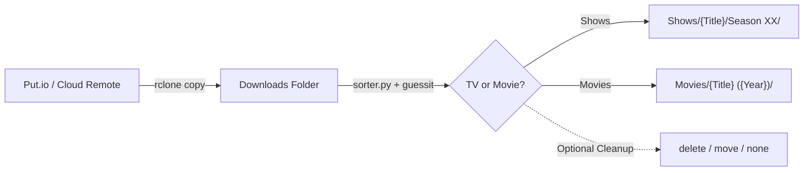

# jellyfin-reel-sort

Automated synchronization and media organizing pipeline for Jellyfin libraries.

`jellyfin-reel-sort` provides an automated, lock-protected workflow to ingest downloads from a remote service (such as Put.io via `rclone`), parse media filenames, and organize them into standardized Jellyfin-compatible directory structures using **hardlinks** (preserving disk space and original download paths).

---

## Architecture & How It Works



1. **`putsync.sh` (Sync Orchestrator)**:
   - Uses `flock` on a lockfile to prevent overlapping runs.
   - Triggers `rclone copy` from remote (`put.io:/`) to the local staging folder (`DOWNLOADS_DIR`).
   - Logs execution progress and timestamps.
   - Automatically executes `sorter.py` immediately after transfer completion.

2. **`sorter.py` (Parser, Hardlinker & Source Cleanup)**:
   - Recursively traverses `DOWNLOADS_DIR` searching for video containers (`.mkv`, `.mp4`, `.avi`).
   - Uses [guessit](https://github.com/guessit-io/guessit) to extract show title, season/episode numbers, movie title, and release year.
   - **TV Shows**: Formats into `Shows/<Show Name>/Season <XX>/<Show Name> - S<XX>E<YY>.<ext>`.
   - **Movies**: Formats into `Movies/<Movie Name> (<Year>)/<Movie Name> (<Year>).<ext>`.
   - Uses `os.link` to create **hardlinks** rather than moving or copying files:
     - Zero extra disk storage consumed.
     - Leaves original files intact in downloads for continued seeding/tracking (or optionally removes/archives them).
     - Automatically skips files if the destination hardlink already exists.
   - **Configurable Source Cleanup (`CLEANUP_MODE`)**:
     - `none` *(default)*: Keeps download source file intact (best for torrent seeding).
     - `delete`: Deletes source file after hardlink is created.
     - `move`: Moves source file to an archive folder (`ARCHIVE_DIR`).

---

## Quick Installation

Run the interactive installer script:

```bash
git clone https://github.com/sircharlesxx/jellyfin-reel-sort.git
cd jellyfin-reel-sort
./install.sh
```

The installer will:
1. Verify / install `guessit` and check `rclone`.
2. Interactively prompt you for your custom storage paths and preferences:
   - Downloads / ingest staging directory
   - Jellyfin media library directory
   - Cleanup mode (`none`, `delete`, or `move`)
   - Rclone remote name (e.g. `put.io`)
   - Destination installation directory (`~/.local/bin`)
3. Write your custom configuration file (`~/.config/jellyfin-reel-sort.conf`).
4. Install executable scripts to your specified path.

---

## Project Structure

```text
jellyfin-reel-sort/
├── install.sh          # Interactive automated installer
├── putsync.sh          # Orchestration script with flock and rclone copy
├── sorter.py           # Media parsing, hardlink sorting & cleanup engine
└── README.md           # Documentation
```

---

## Manual Execution & Automation

### Run Manually
```bash
~/.local/bin/putsync.sh
```
Or run the hardlink sorter directly:
```bash
python3 ~/.local/bin/sorter.py
```

### Automation via Cron
To run every 30 minutes automatically, add this entry to `crontab -e`:

```cron
*/30 * * * * ~/.local/bin/putsync.sh >/dev/null 2>&1
```
*(The built-in `flock` ensures subsequent executions exit safely if a transfer is still ongoing).*
