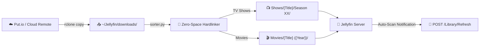
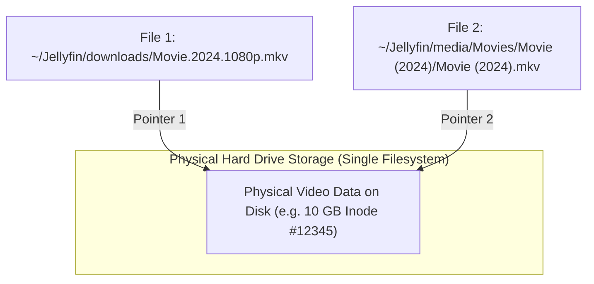
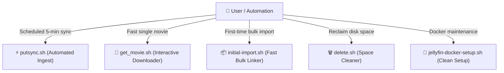
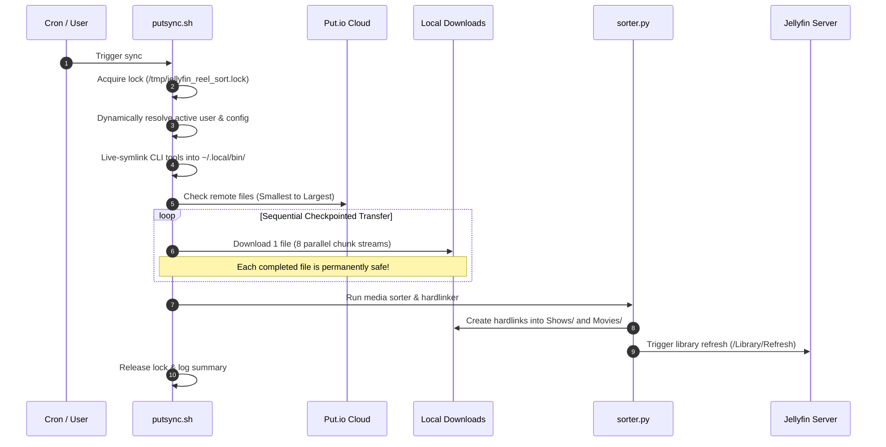

# 🎬 Jellyfin Reel Sort

> **Automated, rock-solid media synchronization, smart hardlinking, subtitle fetching, and library management for Jellyfin.**

`jellyfin-reel-sort` bridges your cloud storage (such as Put.io via `rclone`) directly into your Jellyfin media server. It downloads media at maximum connection speeds, organizes titles into standardized Jellyfin structures using **zero-space hardlinks**, and keeps your library refreshed automatically.

---

## 🌟 High-Level Architecture



---

## 💡 How Hardlinks Save Your Disk Space

Standard download setups often duplicate files: one copy in `downloads/` and another in `Movies/`, burning double the storage. 

`jellyfin-reel-sort` uses **filesystem hardlinks**. Both paths point to the **exact same physical data on disk**:



### Why This Is Better:
- **0 Extra Disk Space**: A 10 GB movie consumes exactly 10 GB total, even though it appears in both folders.
- **Continuous Seeding & Skipping**: Your download stays intact in `downloads/`, allowing `rclone` to skip already-downloaded files in milliseconds.
- **Clean Jellyfin UI**: Jellyfin sees clean, beautiful filenames (`Inception (2010)/Inception (2010).mkv`) instead of raw release names.

---

## 🛠️ The 5 Core Tools

All tools live in your repository and automatically live-symlink themselves into `~/.local/bin/` on startup. Once pulled, you can run them directly from anywhere!



| Command | Alias | What It Does |
| :--- | :--- | :--- |
| `putsync.sh` | — | **Main automated sync**: Downloads new media sequentially, hardlinks it, and pings Jellyfin. |
| `get_movie.sh` | `get_media.sh` | **Single-item downloader**: Lets you browse or search remote media and pull it down with custom concurrency. |
| `initial-import.sh` | `import_media.sh` | **Bulk library importer**: Instantly sorts and links pre-existing files from `downloads/` into your library. |
| `delete.sh` | — | **Space cleaner**: Interactively browse and delete items from Jellyfin, downloads, and cloud remote together. |
| `jellyfin-docker-setup.sh` | `docker-reinstall.sh` | **Docker installer**: Factory resets or installs official Jellyfin Docker with GPU acceleration and correct mounts. |

---

## 🔄 Automated Ingest & Checkpoint Pipeline

When `putsync.sh` runs (manually or via cron), it executes this resilient sequence:



### Built-in Safety Features:
1. **Non-Blocking Lock (`flock`)**: If a sync is already running, new runs exit immediately so transfers never collide.
2. **Sequential Checkpointing (`--transfers 1`)**: Downloads files one-by-one from smallest to largest. If interrupted, completed files stay safe on disk and will never re-download.
3. **In-Flight Protection**: The sorter automatically skips `.partial`, `.crdownload`, `.tmp` files, stubs under 1MB, and files modified within the last 10 seconds.
4. **Universal Rclone Compatibility**: Dynamically inspects `rclone copy --help` so advanced flags (`--order-by`, `--check-first`, `--multi-thread-streams`) only apply if supported, preventing crashes on older NAS releases.

---

## 🚀 Quick Installation

Run the automated installer on your NAS or Linux server:

```bash
git clone https://github.com/sircharlesxx/jellyfin-reel-sort.git
cd jellyfin-reel-sort
./install.sh
```

### What `install.sh` handles automatically:
- **Zero-Friction Python**: Handles modern Debian/Ubuntu `PEP 668` restrictions by configuring a dedicated virtual environment if necessary.
- **Auto-Discovery**: Scans for existing media and download directories across local drives and Synology `/volume1/` shares.
- **Rclone Detection**: Detects existing Put.io remotes automatically.
- **Jellyfin Container Detection**: Probes active Docker port bindings or localhost port `8096`.

---

## ⚡ Performance & Cellular (5G UW) Optimization

Through real-world link benchmarks on cellular 5G Ultra Wideband and high-speed broadband, concurrency defaults are tuned for maximum throughput:

- **`SYNC_TRANSFERS=1`**: Transfers 1 file at a time. This guarantees that every completed file acts as a permanent checkpoint.
- **`SYNC_STREAMS=8`**: Splits that single file into **8 simultaneous HTTP range streams**, triggering aggressive 5G carrier aggregation and pushing download speeds up to **~190–240 Mbps (~25–30 MB/s)**.

### Customizing Concurrency On-The-Fly:
```bash
# Example: Download with 12 streams for maximum throughput
SYNC_STREAMS=12 putsync.sh

# Example: Run get_movie.sh and choose custom concurrency when prompted
get_movie.sh
```

---

## 📖 Everyday Cheat Sheet

### 1. Run a Sync Right Now
```bash
putsync.sh
```

### 2. Download a Specific Movie Quickly
```bash
get_movie.sh
```

### 3. Bulk Import Pre-Existing Media
If you already have a folder full of downloaded movies or TV episodes:
```bash
# Blazing-fast mode (creates hardlinks in seconds, skips online subtitle API delays)
initial-import.sh --fast

# Or import from a custom folder:
initial-import.sh /path/to/my/folder --fast
```

### 4. Delete Media to Free Disk Space
```bash
delete.sh
```
*(Prompts to remove the title from your Jellyfin library, your downloads folder, and optionally your Put.io remote).*

### 5. Automated Crontab Schedule
To run background syncs automatically every 5 minutes:

**User Crontab (Recommended — `crontab -e`):**
```cron
*/5 * * * * ~/.local/bin/putsync.sh >/dev/null 2>&1
```

**Root Crontab (`sudo crontab -e`):**
```cron
*/5 * * * * /home/<username>/.local/bin/putsync.sh >/dev/null 2>&1
```
*(When executed via root cron, `putsync.sh` automatically detects the real target user and keeps all file ownership aligned).*

---

## ⚙️ Configuration Reference

All settings can be customized in `~/.config/jellyfin-reel-sort.conf` (or via environment variables):

| Setting | Purpose | Default |
| :--- | :--- | :--- |
| `DOWNLOADS_DIR` | Ingest directory where downloads arrive | `~/Jellyfin/downloads/` |
| `MEDIA_DIR` | Base Jellyfin library directory | `~/Jellyfin/media/` |
| `SHOWS_DIR` | Destination directory for TV Shows | `~/Jellyfin/media/Shows/` |
| `MOVIES_DIR` | Destination directory for Movies | `~/Jellyfin/media/Movies/` |
| `SYNC_TRANSFERS` | Number of simultaneous file transfers (`1` for checkpointing) | `1` |
| `SYNC_STREAMS` | Multi-threaded parallel chunk streams per file | `8` |
| `CLEANUP_MODE` | Post-sort source handling (`none`, `delete`, or `move`) | `none` *(keeps hardlinks intact)* |
| `REMOTE_NAME` | Rclone remote name configured for your cloud storage | `put.io` |
| `JELLYFIN_URL` | Base URL of your Jellyfin server | `http://localhost:8096` |
| `JELLYFIN_API_KEY`| API key to trigger automatic library refreshes | Optional |
| `DOWNLOAD_SUBTITLES`| Automatically query online subtitle providers | `true` |
| `SUBTITLE_LANGUAGES`| Subtitle language code(s) comma-separated | `en` |

---

## 👥 Contributors & Acknowledgements

- **Charles Peters** ([@sircharlesxx](https://github.com/sircharlesxx)) — Project Creator & Maintainer
- **Kyle Keller** ([@kellerk563](https://github.com/kellerk563)) — Core Contributor: Designed and implemented the source cleanup pipeline (`delete` / `move` archival workflow) to manage extra and unwanted download files, along with unrecognized media pattern detection.
