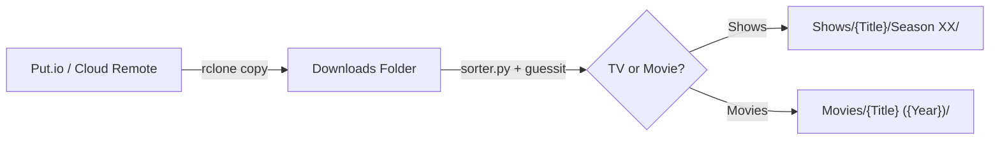

# jellyfin-reel-sort

Automated synchronization and media organizing pipeline for Jellyfin libraries.

`jellyfin-reel-sort` provides an automated, lock-protected workflow to ingest downloads from a remote service (such as Put.io via `rclone`), parse media filenames, and organize them into standardized Jellyfin-compatible directory structures using **hardlinks** (preserving disk space and original download paths).

---

## Architecture & How It Works



1. **`putsync.sh` (Sync Orchestrator)**:
   - Uses `flock` on `/tmp/rclone_putio.lock` to prevent overlapping runs.
   - Triggers `rclone copy` from remote (`put.io:/`) to the local staging folder (`LOCAL_PATH`).
   - Logs execution progress and timestamps to `/var/log/rclone_putio_copy.log`.
   - Automatically executes `sorter.py` immediately after transfer completion.

2. **`sorter.py` (Parser & Hardlinker)**:
   - Recursively traverses `DOWNLOADS_DIR` searching for video containers (`.mkv`, `.mp4`, `.avi`).
   - Uses [guessit](https://github.com/guessit-io/guessit) to extract show title, season/episode numbers, movie title, and release year.
   - **TV Shows**: Formats into `Shows/<Show Name>/Season <XX>/<Show Name> - S<XX>E<YY>.<ext>`.
   - **Movies**: Formats into `Movies/<Movie Name> (<Year>)/<Movie Name> (<Year>).<ext>`.
   - Uses `os.link` to create **hardlinks** rather than moving or copying files:
     - Zero extra disk storage consumed.
     - Leaves original files intact in downloads for continued seeding/tracking.
     - Automatically skips files if the destination hardlink already exists.

---

## File Structure

```text
jellyfin-reel-sort/
├── putsync.sh          # Orchestration script with lockfile and rclone sync
├── sorter.py           # Media parsing and hardlinking logic
└── README.md           # Project documentation
```

---

## Requirements

- **Linux / Unix**
- **Python 3**
- Python dependency:
  ```bash
  pip install guessit
  ```
- **rclone** installed and configured:
  ```bash
  rclone config
  ```
  *(Configured with a remote named `put.io` or adjusted to your remote name)*

---

## Configuration

### 1. File Paths
Adjust directory paths according to your Jellyfin storage layout:

- In `putsync.sh`:
  - `REMOTE_NAME`: Remote name configured in rclone (default: `"put.io"`)
  - `LOCAL_PATH`: Local staging/download folder
  - `LOG_FILE`: Log output path (default: `/var/log/rclone_putio_copy.log`)
  - Path to `sorter.py`

- In `sorter.py`:
  - `DOWNLOADS_DIR`: Path to staging/download directory
  - `MEDIA_DIR`: Path to base Jellyfin media folder (containing `Shows/` and `Movies/`)

---

## Running & Scheduling

### Manual Run
```bash
./putsync.sh
```

Or run the sorter independently on existing downloads:
```bash
python3 sorter.py
```

### Automation via Cron
To run the sync and sort job automatically (e.g., every 30 minutes), add an entry to your crontab (`crontab -e`):

```cron
*/30 * * * * /home/tpeters/jellyfin-reel-sort/putsync.sh >/dev/null 2>&1
```
*(The built-in `flock` ensures that if a previous run is still transferring, subsequent jobs exit safely without clashing).*
