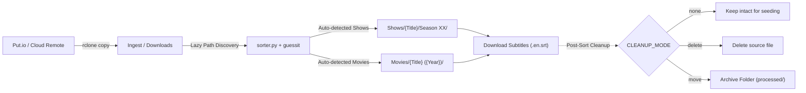

# jellyfin-reel-sort

Automated synchronization, media organizing, subtitle downloading, and post-processing pipeline for Jellyfin libraries.

`jellyfin-reel-sort` provides an automated, lock-protected workflow to ingest downloads from a remote service (such as Put.io via `rclone`), parse media filenames, organize them into standardized Jellyfin-compatible directory structures using **hardlinks** (preserving disk space and original download paths), download matching subtitles, and handle optional post-sort cleanup.

---

## Dynamic Environment & Lazy Discovery

`jellyfin-reel-sort` includes **smart lazy path discovery** to adapt dynamically across diverse environments (Synology DSM volumes `/volume1/...`, Linux home directories `~/...`, unRAID `/mnt/user/...`, TrueNAS pools, Docker mounts, etc.):

- **Dynamic Download Ingest Discovery**: Auto-detects standard downloads directories across home folders, Synology volumes, mount points, or custom config paths.
- **Dynamic Media Library Discovery**: Automatically inspects base media folders and locates existing TV shows (`Shows/`, `shows/`, `TV Shows/`, `TV/`, `Series/`) and movies directories (`Movies/`, `movies/`, `Films/`).
- **Resilient Dependency Management**: Automatically handles Debian/Ubuntu/TrueNAS **externally-managed PEP 668 environments** using `apt`, user packages, or dedicated virtual environments.
- **Zero Hardcoded Paths**: Runs out-of-the-box in multiple server topologies without requiring code edits.

---

## Architecture & How It Works



1. **`putsync.sh` (Sync Orchestrator)**:
   - Uses `flock` on a lockfile to prevent overlapping or concurrent runs.
   - Triggers `rclone copy` from remote (`put.io:/`) to the local staging folder (`DOWNLOADS_DIR`).
   - Logs execution progress and timestamps to the configured log file.
   - Automatically executes `sorter.py` using the configured or dedicated virtual environment Python interpreter.

2. **`sorter.py` (Parser, Hardlinker, Subtitle Downloader & Cleanup Engine)**:
   - Evaluates storage targets using lazy discovery or explicit config parameters.
   - Recursively traverses `DOWNLOADS_DIR` searching for video containers (`.mkv`, `.mp4`, `.avi`).
   - Uses [guessit](https://github.com/guessit-io/guessit) to extract show title, season/episode numbers, movie title, and release year.
   - **TV Shows**: Formats into `Shows/<Show Name>/Season <XX>/<Show Name> - S<XX>E<YY>.<ext>`.
   - **Movies**: Formats into `Movies/<Movie Name> (<Year>)/<Movie Name> (<Year>).<ext>`.
   - Uses `os.link` to create **hardlinks** rather than moving or copying files:
     - Zero extra disk storage consumed.
     - Automatically skips files if the destination hardlink already exists.
   - **Automatic Subtitle Fetching**:
     - Uses [subliminal](https://github.com/Diaoul/subliminal) to query multiple subtitle providers (OpenSubtitles, Podnapisi, TVsubtitles, Gestdown, etc.).
     - Automatically detects if subtitles already exist beside the video to prevent duplicate downloads.
     - Formats subtitles according to Jellyfin naming conventions (e.g. `Show - S01E01.en.srt`, `Movie (2023).en.srt`).
     - Configurable language support (single or multiple languages comma-separated).
   - **Configurable Source Cleanup (`CLEANUP_MODE`)**:
     - `none` *(default)*: Keeps download source file intact (best for continuous torrent seeding/ratio).
     - `delete`: Deletes source file after hardlink and subtitle processing.
     - `move`: Moves source file to a separate archive directory (`ARCHIVE_DIR`).
   - Logs any skipped files that do not match recognizable movie or show patterns.

---

## Quick Installation

Run the interactive automated installer script:

```bash
git clone https://github.com/sircharlesxx/jellyfin-reel-sort.git
cd jellyfin-reel-sort
./install.sh
```

### What the installer handles automatically:
1. **Dependency Resolution**:
   - Checks for `guessit` and `subliminal`.
   - If in an **externally-managed Python environment** (Ubuntu/Debian `PEP 668`), it attempts `apt`, falls back to `--break-system-packages`, or creates a dedicated virtual environment at `~/.local/share/jellyfin-reel-sort/venv` so you never run into pip errors.
2. **Auto-Path Detection**:
   - Auto-detects local downloads and media folders and sets them as the default options.
3. **Interactive Configuration**:
   - Ingest staging folder, Jellyfin media folder, cleanup mode (`none`/`delete`/`move`), subtitle downloading preferences, and rclone remote.
4. **Configuration & Scripts Deployment**:
   - Writes `~/.config/jellyfin-reel-sort.conf` and installs `putsync.sh` and `sorter.py` to `~/.local/bin`.

---

## Project Structure

```text
jellyfin-reel-sort/
├── install.sh          # Interactive automated installer with PEP 668 & apt support
├── putsync.sh          # Orchestration script with flock and rclone copy
├── sorter.py           # Media parsing, lazy discovery, hardlinker, subtitles & cleanup
├── requirements.txt    # Python dependencies list
├── .gitignore          # Ignores bytecode and cache files
└── README.md           # Documentation
```

---

## Configuration Reference

All settings can be customized in `~/.config/jellyfin-reel-sort.conf` (or via environment variables). If omitted, lazy discovery automatically locates them:

| Variable | Description | Default / Discovery Fallback |
| :--- | :--- | :--- |
| `DOWNLOADS_DIR` | Ingest folder where downloads arrive | Auto-discovered (or `~/Jellyfin/downloads/`) |
| `MEDIA_DIR` | Base Jellyfin library folder | Auto-discovered (or `~/Jellyfin/media/`) |
| `SHOWS_DIR` | Destination directory for TV Shows | Auto-discovered (`Shows/`, `TV/`, etc.) |
| `MOVIES_DIR` | Destination directory for Movies | Auto-discovered (`Movies/`, `Films/`, etc.) |
| `CLEANUP_MODE` | Post-linking source handling (`none`, `delete`, `move`) | `none` |
| `ARCHIVE_DIR` | Destination folder when `CLEANUP_MODE="move"` | `~/Jellyfin/processed/` |
| `DOWNLOAD_SUBTITLES` | Whether to automatically fetch subtitles (`true` / `false`) | `true` |
| `SUBTITLE_LANGUAGES` | Comma-separated language codes for subtitles | `en` |
| `PYTHON_BIN` | Python interpreter (points to venv if externally managed) | `python3` or dedicated venv path |
| `REMOTE_NAME` | Rclone remote name configured for your cloud storage | `put.io` |
| `LOG_FILE` | Log output file for transfers and sorting | `~/.local/state/jellyfin-reel-sort/sync.log` |
| `LOCK_FILE` | Lockfile used by `flock` to prevent collisions | `/tmp/jellyfin_reel_sort.lock` |
| `SORTER_PATH` | Path to executable `sorter.py` | Installed script path |

---

## Subtitle Naming Structure for Jellyfin

Subtitles are automatically saved beside the media file following Jellyfin's recommended naming scheme:

```text
Shows/
  └── Breaking Bad/
      └── Season 01/
          ├── Breaking Bad - S01E01.mkv
          └── Breaking Bad - S01E01.en.srt

Movies/
  └── Inception (2010)/
      ├── Inception (2010).mkv
      └── Inception (2010).en.srt
```

---

## Manual Execution & Automation

### Run Manually
```bash
~/.local/bin/putsync.sh
```
Or run the hardlink sorter independently:
```bash
python3 ~/.local/bin/sorter.py
```

### Automation via Cron
To run every 30 minutes automatically, add this entry to `crontab -e`:

```cron
*/30 * * * * ~/.local/bin/putsync.sh >/dev/null 2>&1
```
*(The built-in `flock` ensures subsequent executions exit safely if a transfer is still ongoing).*

---

## Contributors & Acknowledgements

- **Charles Peters** ([@sircharlesxx](https://github.com/sircharlesxx)) - Project Creator & Maintainer
- **Kyle Keller** ([@kellerk563](https://github.com/kellerk563)) - Core Contributor: Designed and implemented the source cleanup pipeline (`delete` / `move` archival workflow) to manage extra and unwanted download files, along with unrecognized media pattern detection.
