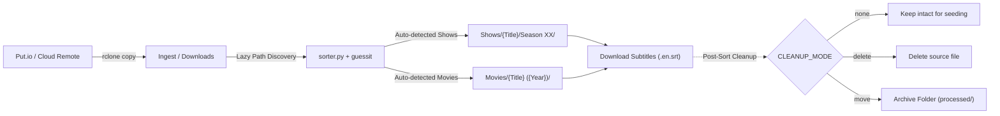

# jellyfin-reel-sort

Automated synchronization, media organizing, subtitle downloading, and post-processing pipeline for Jellyfin libraries.

`jellyfin-reel-sort` provides an automated, lock-protected workflow to ingest downloads from a remote service (such as Put.io via `rclone`), parse media filenames, organize them into standardized Jellyfin-compatible directory structures using **hardlinks** (preserving disk space and original download paths), download matching subtitles, and handle optional post-sort cleanup.

---

## Dynamic Environment & Lazy Discovery

`jellyfin-reel-sort` includes **smart lazy path discovery** to adapt dynamically across diverse environments (Synology DSM volumes `/volume1/...`, Linux home directories `~/...`, unRAID `/mnt/user/...`, TrueNAS pools, Docker mounts, etc.):

- **Dynamic Target User Resolution**: Zero hardcoded usernames. Automatically detects and adapts to the active user (via `$TARGET_USER`, `$SUDO_USER`, `.config` ownership, repo filesystem ownership, or UID ≥ 1000).
- **Auto-Symlinking CLI Architecture**: Running any script automatically verifies and live-symlinks CLI tools into `~/.local/bin/` (`putsync.sh`, `get_movie.sh`, `get_media.sh`, `initial-import.sh`, `import_media.sh`, `delete.sh`, `docker-reinstall.sh`). Running `git pull` instantly updates all commands system-wide without manual copying.
- **Dynamic Download Ingest Discovery**: Auto-detects standard downloads directories across home folders, Synology volumes, mount points, or custom config paths.
- **Dynamic Media Library Discovery**: Automatically inspects base media folders and locates existing TV shows (`Shows/`, `shows/`, `TV Shows/`, `TV/`, `Series/`) and movies directories (`Movies/`, `movies/`, `Films/`).
- **Resilient Dependency Management**: Automatically handles Debian/Ubuntu/TrueNAS **externally-managed PEP 668 environments** using `apt`, user packages, or dedicated virtual environments.
- **Dynamic Rclone Capability Detection**: Automatically probes installed `rclone` features so advanced flags (`--order-by`, `--check-first`, `--multi-thread-streams`) only activate if supported, ensuring universal compatibility across older NAS versions (rclone < 1.65) and modern distributions alike.
- **Zero Hardcoded Paths**: Runs out-of-the-box in multiple server topologies without requiring code edits.

---

## Architecture & How It Works



1. **`putsync.sh` (Sync & Orchestration Pipeline)**:
   - Uses `flock` on a non-blocking lockfile to prevent overlapping runs from cron or manual invocations.
   - Dynamically resolves target user without hardcoding (`$TARGET_USER`, `$SUDO_USER`, `.config` ownership, repo owner, or UID ≥ 1000).
   - Automatically checks and maintains live symlinks in `~/.local/bin/` so commands update automatically with `git pull`.
   - **Checkpointing & Resilience**: Transfers 1 file at a time sequentially from smallest to largest (`--transfers 1`). Finished files act as permanent checkpoints and are never re-downloaded if an in-progress transfer is interrupted.
   - **High Throughput Multi-Streaming**: Downloads in 8 parallel chunk streams (`--multi-thread-streams 8`), maximizing throughput on 5G UW carrier aggregation and high-speed broadband connections.
   - **Universal Rclone Compatibility**: Dynamically inspects rclone help capabilities so flags like `--order-by`, `--check-first`, and `--multi-thread-streams` adapt automatically across all rclone versions without failing on older NAS releases.
   - Logs execution progress and timestamps cleanly to the configured log file.
   - Automatically executes `sorter.py` using the appropriate environment Python interpreter.

2. **`sorter.py` (Parser, Hardlinker, Subtitle Downloader & Cleanup Engine)**:
   - Evaluates storage targets using lazy discovery or explicit config parameters.
   - Recursively traverses `DOWNLOADS_DIR` searching for video containers (`.mkv`, `.mp4`, `.avi`).
   - Uses [guessit](https://github.com/guessit-io/guessit) to extract show title, season/episode numbers, movie title, and release year.
   - **TV Shows**: Formats into `Shows/<Show Name>/Season <XX>/<Show Name> - S<XX>E<YY>.<ext>`.
   - **Movies**: Formats into `Movies/<Movie Name> (<Year>)/<Movie Name> (<Year>).<ext>`.
   - Uses `os.link` to create **hardlinks** rather than moving or copying files:
     - Zero extra disk storage consumed.
     - Automatically skips files if the destination hardlink already exists.
   - **Automatic Subtitle Fetching**:
     - Uses [subliminal](https://github.com/Diaoul/subliminal) to query multiple subtitle providers (OpenSubtitles, Podnapisi, TVsubtitles, Gestdown, etc.).
     - Automatically detects if subtitles already exist beside the video to prevent duplicate downloads.
     - Creates a `.nosubs` marker when no subtitles are available online, preventing repeated queries on future runs (marker automatically clears if subtitles are later added).
     - Formats subtitles according to Jellyfin naming conventions (e.g. `Show - S01E01.en.srt`, `Movie (2023).en.srt`).
     - Configurable language support (single or multiple languages comma-separated).
   - **Automatic Jellyfin Library Refresh**:
     - Automatically detects running Jellyfin instances (via Docker port mapping or localhost port probe on `8096`, `8920`, etc.).
     - Triggers `POST /Library/Refresh` via API only when new media was sorted or new subtitles were downloaded.
   - **Configurable Source Cleanup (`CLEANUP_MODE`)**:
     - `none` *(default)*: Keeps download source file intact (best for continuous torrent seeding/ratio).
     - `delete`: Deletes source file after hardlink and subtitle processing.
     - `move`: Moves source file to a separate archive directory (`ARCHIVE_DIR`).
   - Logs any skipped files that do not match recognizable movie or show patterns.

---

## Quick Installation

Run the interactive automated installer script:

```bash
git clone https://github.com/sircharlesxx/jellyfin-reel-sort.git
cd jellyfin-reel-sort
./install.sh
```

### What the installer handles automatically:
1. **Dependency Resolution**:
   - Checks for `guessit` and `subliminal`.
   - If in an **externally-managed Python environment** (Ubuntu/Debian `PEP 668`), it attempts `apt`, falls back to `--break-system-packages`, or creates a dedicated virtual environment at `~/.local/share/jellyfin-reel-sort/venv` so you never run into pip errors.
2. **Auto-Path Detection**:
   - Auto-detects local downloads and media folders and sets them as the default options.
3. **Interactive Configuration**:
   - Ingest staging folder, Jellyfin media folder, cleanup mode (`none`/`delete`/`move`), subtitle downloading preferences, and rclone remote.
4. **Configuration & Scripts Deployment**:
   - Writes `~/.config/jellyfin-reel-sort.conf` and installs `putsync.sh` and `sorter.py` to `~/.local/bin`.

---

## Project Structure

```text
jellyfin-reel-sort/
├── install.sh                # Interactive automated installer with PEP 668 & apt support
├── putsync.sh                # Orchestration script with flock and rclone copy
├── sorter.py                 # Media parsing, lazy discovery, hardlinker, subtitles & cleanup
├── jellyfin-docker-setup.sh  # Clean Docker Jellyfin install & hardlink directory setup
├── initial-import.sh         # Fast initial/bulk import of existing downloads into Jellyfin
├── delete.sh                 # Interactive media deleter across Jellyfin, downloads & Put.io
├── get_movie.sh              # Interactive single-item downloader with concurrency control
├── requirements.txt          # Python dependencies list
├── .gitignore                # Ignores bytecode and cache files
└── README.md                 # Documentation
```

---

## Configuration Reference

All settings can be customized in `~/.config/jellyfin-reel-sort.conf` (or via environment variables). If omitted, lazy discovery automatically locates them:

| Variable | Description | Default / Discovery Fallback |
| :--- | :--- | :--- |
| `DOWNLOADS_DIR` | Ingest folder where downloads arrive | Auto-discovered (or `~/Jellyfin/downloads/`) |
| `MEDIA_DIR` | Base Jellyfin library folder | Auto-discovered (or `~/Jellyfin/media/`) |
| `SHOWS_DIR` | Destination directory for TV Shows | Auto-discovered (`Shows/`, `TV/`, etc.) |
| `MOVIES_DIR` | Destination directory for Movies | Auto-discovered (`Movies/`, `Films/`, etc.) |
| `CLEANUP_MODE` | Post-linking source handling (`none`, `delete`, `move`) | `none` |
| `ARCHIVE_DIR` | Destination folder when `CLEANUP_MODE="move"` | `~/Jellyfin/processed/` |
| `DOWNLOAD_SUBTITLES` | Whether to automatically fetch subtitles (`true` / `false`) | `true` |
| `SUBTITLE_LANGUAGES` | Comma-separated language codes for subtitles | `en` |
| `SUBTITLE_PROVIDERS` | Comma-separated provider list (auto-filters dead domains) | Auto (active providers) |
| `SUBTITLE_DELAY` | Seconds to wait between provider API calls (jitter added) | `2.0` |
| `PYTHON_BIN` | Python interpreter (points to venv if externally managed) | `python3` or dedicated venv path |
| `REMOTE_NAME` | Rclone remote name configured for your cloud storage | `put.io` |
| `JELLYFIN_URL` | Base URL of Jellyfin server (auto-detected if blank) | `http://localhost:8096` |
| `JELLYFIN_API_KEY` | Jellyfin API key to trigger library scan on import | Empty (optional) |
| `LOG_FILE` | Log output file for transfers and sorting | `~/.local/state/jellyfin-reel-sort/sync.log` |
| `LOCK_FILE` | Lockfile used by `flock` to prevent collisions | `/tmp/jellyfin_reel_sort.lock` |
| `SORTER_PATH` | Path to executable `sorter.py` | Installed script path |
| `SYNC_TRANSFERS` | Simultaneous file transfers (`1` enforces sequential checkpointing) | `1` |
| `SYNC_STREAMS` | Parallel multi-threaded chunk streams per file (optimized for 5G UW) | `8` |

---

## Subtitle Naming Structure for Jellyfin

Subtitles are automatically saved beside the media file following Jellyfin's recommended naming scheme:

```text
Shows/
  └── Breaking Bad/
      └── Season 01/
          ├── Breaking Bad - S01E01.mkv
          └── Breaking Bad - S01E01.en.srt

Movies/
  └── Inception (2010)/
      ├── Inception (2010).mkv
      └── Inception (2010).en.srt
```

---

## Manual Execution & Automation

### Run Manually
Because all scripts are automatically symlinked to `~/.local/bin/` (which is in standard user `$PATH`), you can run them directly from any terminal prompt:
```bash
putsync.sh
```
Or run directly from your local repository clone:
```bash
~/jellyfin-reel-sort/putsync.sh
```
Or run the hardlink sorter independently:
```bash
python3 ~/.local/bin/sorter.py
```

### Automation via Cron
You can run automated syncs on a recurring schedule (e.g. every 5 or 15 minutes). The built-in `flock` ensures subsequent executions exit safely without overlapping if a previous transfer is still in-progress.

**Option A: User Crontab (Recommended — `crontab -e`)**
```cron
*/5 * * * * ~/.local/bin/putsync.sh >/dev/null 2>&1
```

**Option B: Root Crontab (`sudo crontab -e`)**
```cron
*/5 * * * * /home/<username>/.local/bin/putsync.sh >/dev/null 2>&1
```
*(When run as root, `putsync.sh` automatically resolves `<username>`, loads the user's configuration, and maintains proper file ownership).*

---

## Setup & Verification Checklist

Follow these steps to complete and verify your setup end-to-end:

### 1. Update Repository on Host / NAS
```bash
cd ~/jellyfin-reel-sort
git pull
```

### 2. First-Time Jellyfin Web Setup
1. Open your browser and navigate to:
   ```text
   http://<YOUR-NAS-IP>:8096
   ```
2. Complete the initial user and password setup.
3. When prompted to **Add Media Libraries**:
   - Click **Add Media Library** → Content type: **Movies** → Add folder: `+/media/Movies`
   - Click **Add Media Library** → Content type: **Shows** (or Series) → Add folder: `+/media/Shows`
   > [!IMPORTANT]
   > Select `/media/Movies` and `/media/Shows` directly inside the Docker container mount; do not use `/home/...`.
4. Finish the wizard and log into the web UI.

### 3. (Recommended) Enable Auto-Refresh API Key
Enable automatic library refreshes when media is sorted or deleted:
1. In the Jellyfin web UI, go to **Administration → Dashboard → API Keys**.
2. Click **+** to generate a new API key named `reel-sort`.
3. Add the key to `~/.config/jellyfin-reel-sort.conf`:
   ```bash
   JELLYFIN_API_KEY="your-api-key-here"
   ```

### 4. Run a Test Sync
Verify the ingest pipeline manually in your terminal:
```bash
~/jellyfin-reel-sort/putsync.sh
```
Or test downloading and sorting a specific movie interactively:
```bash
~/jellyfin-reel-sort/get_movie.sh
```

### 5. Automated Crontab Schedule
To run background syncs automatically every 5 minutes, add to your user crontab (`crontab -e`):
```cron
*/5 * * * * ~/.local/bin/putsync.sh >/dev/null 2>&1
```
Or to root crontab (`sudo crontab -e`):
```cron
*/5 * * * * /home/<username>/.local/bin/putsync.sh >/dev/null 2>&1
```

---

## Helper Utilities & Setup Tools

### Jellyfin Docker Setup (`jellyfin-docker-setup.sh`)
Provides an automated clean install / reinstall of Jellyfin via Docker configured specifically for hardlinks:
- Wipes stale database/cache without touching video files.
- Sets up matching single-filesystem directories (`~/Jellyfin/downloads`, `~/Jellyfin/media/Shows`, `~/Jellyfin/media/Movies`).
- Configures proper UID/GID permissions (`775`), `/dev/dri` hardware acceleration passthrough, and auto-syncs `~/.config/jellyfin-reel-sort.conf`.

```bash
sudo ./jellyfin-docker-setup.sh
```

### Initial Media Import (`initial-import.sh` / `import_media.sh`)
Bulk-sort and import pre-existing downloads from `~/Jellyfin/downloads/` (or any custom folder) directly into your Jellyfin library:
- Parses titles, seasons, episodes, and release years via `guessit`.
- Creates zero-space hardlinks directly into `Shows/` and `Movies/`.
- Links and sanitizes local packaged `.srt` subtitles.
- Choose between **Fast Import** (skips online subtitle API delays to link your library in seconds) or **Full Import with Online Subtitles**.
- Automatically aligns file ownership and `775` permissions for Docker.
- Triggers a Jellyfin library scan upon completion.

```bash
# Interactive run (imports ~/Jellyfin/downloads/)
./initial-import.sh

# Blazing-fast bulk import skipping online subtitle lookups
./initial-import.sh --fast

# Import from a custom directory
./initial-import.sh /path/to/custom/folder --fast
```

### Interactive Media Removal (`delete.sh`)
Safely remove titles from Jellyfin libraries, local downloads staging, and optionally the Put.io cloud remote:
```bash
./delete.sh
```

### Targeted Single-Item Downloader (`get_movie.sh` / `get_media.sh`)
Interactively select and download a specific movie or show directly from Put.io with custom concurrency (`--transfers`, `--multi-thread-streams`) and immediate targeted sorting:
```bash
./get_movie.sh
```

---

## Contributors & Acknowledgements

- **Charles Peters** ([@sircharlesxx](https://github.com/sircharlesxx)) - Project Creator & Maintainer
- **Kyle Keller** ([@kellerk563](https://github.com/kellerk563)) - Core Contributor: Designed and implemented the source cleanup pipeline (`delete` / `move` archival workflow) to manage extra and unwanted download files, along with unrecognized media pattern detection.
