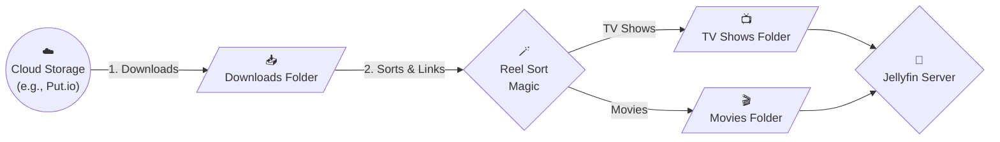
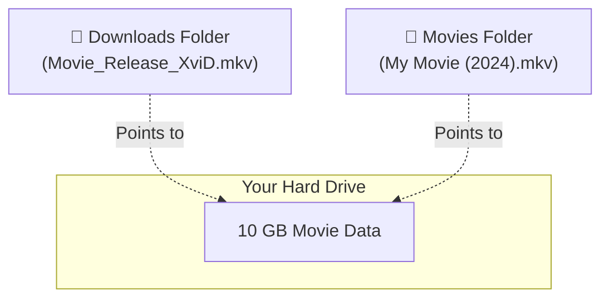

<div align="center">
  <h1>🎬 Jellyfin Reel Sort</h1>
  <p><b>Your personal, automated media butler for Jellyfin!</b></p>

  <p>
    
    
    
  </p>
</div>

---

## 👋 Welcome to Jellyfin Reel Sort!

Imagine having a magic assistant that constantly checks your cloud storage (like Put.io), downloads new movies and TV shows at lightning speed, organizes them perfectly for Jellyfin, and cleans up the mess—all without using up double the space on your hard drive! 

That's exactly what **Jellyfin Reel Sort** does. 🍿

---

## 🚀 How It Works (The Simple Version)

Here is the journey of your media, from the cloud directly to your TV screen:



1. **Downloads:** We securely pull your files from the cloud to your local `downloads` folder.
2. **Sorts & Links:** We magically link the files into beautiful, organized folders for Jellyfin (`Movies/` and `Shows/`). 
3. **Enjoy:** We tap Jellyfin on the shoulder to let it know new stuff is ready to watch!

---

## 🤯 The Magic of "Zero-Space" Hardlinks

When managing media, you usually have two bad options:
1. **Move the file** into your library, which breaks your cloud sync client (it will just try to download it again because it's missing from the downloads folder!).
2. **Copy the file** into your library, which doubles your storage space (a 10GB movie becomes 20GB).

We built Reel Sort to use a neat filesystem trick called **Hardlinking** to solve this. Think of it like a magical portal. 



- 📉 **Saves Space:** Both folders look at the exact same physical data on the drive. A 10GB movie only takes up 10GB total, even though it appears in two places!
- 🤝 **Keeps Cloud Sync Happy:** Your messy original file stays safely in the `downloads/` folder. This means when the auto-sync runs, it instantly recognizes the file is already there and skips it in milliseconds.
- ✨ **Looks Beautiful:** Jellyfin sees a perfectly named, organized file (e.g., `Movies/Inception (2010)/Inception (2010).mkv`), keeping your library clean.

---

## ⚡ Supercharged Downloading (Built for Modern Networks)

Why download files normally when you can download them *faster* and *safer*? We've engineered the sync pipeline to maximize throughput on any connection—whether you are on gigabit fiber, a flaky cellular network, or standard home broadband.

- **The Need for Speed (Multi-Streaming):** Standard downloads pull a file using a single stream, which often idles at a fraction of your total bandwidth. We split every single movie into **8 separate puzzle pieces** and download them simultaneously. This forces your network to give you maximum throughput, turning a slow 30 Mbps crawl into a 240+ Mbps sprint!
- **The Need for Safety (Checkpointing):** Have you ever downloaded 99% of a huge 4K movie, only for the internet to drop and lose everything? We designed Reel Sort to download exactly **1 file at a time**. Once a file finishes, it is permanently locked in. If the power goes out or the connection drops, the script simply resumes from the next file. No wasted bandwidth, no lost progress.

---

## 🛠️ Your Magic Wand Toolkit

Once installed, these easy commands are available to use from anywhere on your server!

| Command | What it does |
| :--- | :--- |
| ⚡ `putsync.sh` | **The Auto-Sync:** Checks the cloud, downloads new stuff, sorts it, and tells Jellyfin. Run this on a schedule! |
| 🎯 `get_movie.sh` | **The Quick Grab:** Search your cloud for a specific movie and download it right now. |
| 📦 `initial-import.sh` | **The Organizer:** Already have a messy folder of downloads? This instantly sorts and links them all into Jellyfin. |
| 🗑️ `delete.sh` | **The Janitor:** Easily delete a movie from Jellyfin, your hard drive, AND the cloud all at once to save space. |
| 🐳 `jellyfin-docker-setup.sh` | **The Installer:** Quickly setup or reset a pristine Jellyfin server using Docker. |

> 💡 **Tip:** We automatically create shortcuts for you, so you can just type `get_movie.sh` anywhere without navigating to a specific folder!

---

## 🏃‍♂️ Quick Installation

Ready to get started? Run this on your NAS or Linux server:

```bash
git clone https://github.com/sircharlesxx/jellyfin-reel-sort.git
cd jellyfin-reel-sort
./install.sh
```

Our smart installer will automatically find your media folders, configure your cloud connection, and set everything up for you!

---

## 📖 Everyday Cheat Sheet

Here are the most common things you might want to do:

### 1. "I want to download a specific movie right now!"
Just type this and follow the prompts:
```bash
get_movie.sh
```

### 2. "I want it to automatically sync every 5 minutes!"
You can tell your server to run the sync automatically using a `cron` schedule. 

Type `crontab -e` in your terminal, and add this line at the bottom:
```cron
*/5 * * * * ~/.local/bin/putsync.sh >/dev/null 2>&1
```

### 3. "My hard drive is full, I need to delete some stuff!"
Run the cleaner to remove media everywhere at once:
```bash
delete.sh
```

### 4. "I already have a bunch of downloads, organize them!"
```bash
initial-import.sh --fast
```

---

## ⚙️ Advanced Settings

Want to peek under the hood? You can edit `~/.config/jellyfin-reel-sort.conf` to customize exactly how things work. 

| Setting | What it means | Default |
| :--- | :--- | :--- |
| `DOWNLOADS_DIR` | Where raw downloads land | `~/Jellyfin/downloads/` |
| `MEDIA_DIR` | Where Jellyfin looks for media | `~/Jellyfin/media/` |
| `SYNC_STREAMS` | How many puzzle pieces to split downloads into (higher = faster) | `8` |
| `CLEANUP_MODE` | Should we delete the raw download after linking? (`none`, `delete`, or `move`) | `none` (saves the file for seeding) |
| `DOWNLOAD_SUBTITLES` | Automatically fetch subtitles for your media? | `true` |

---

## 🤝 The Team

Built with ❤️ by movie nerds, for movie nerds.

- **Charles Peters** ([@sircharlesxx](https://github.com/sircharlesxx)) — Creator & Main Developer
- **Kyle Keller** ([@kellerk563](https://github.com/kellerk563)) — Core Contributor (Cleanup Pipeline & Magic Janitor)
